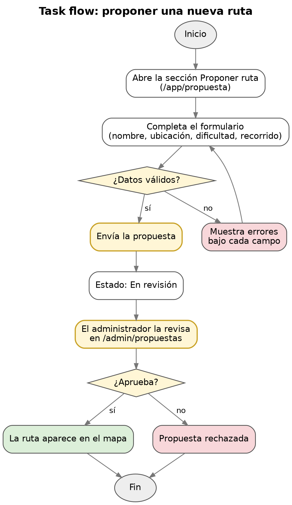
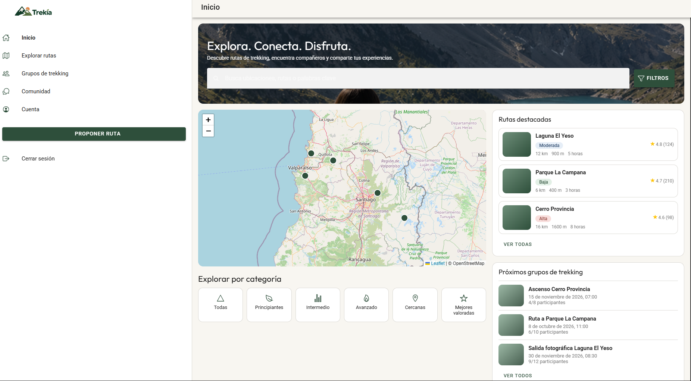
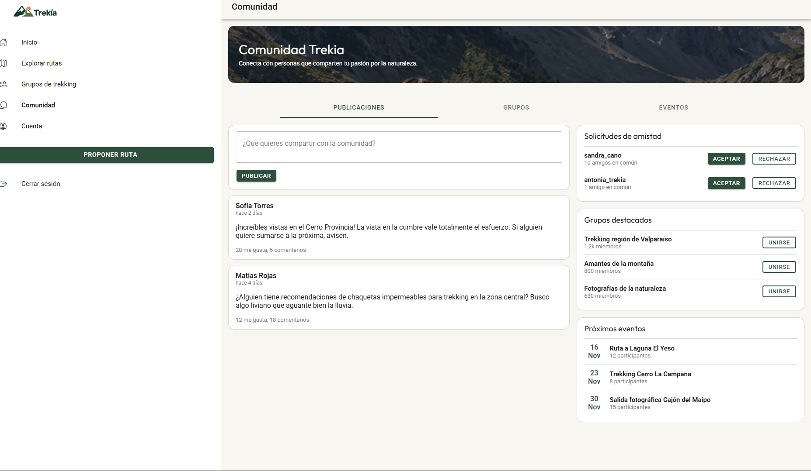

# TREKIA

| Recurso | Enlace |
|---|---|
| Repositorio | [github.com/sharkreiza/TREKIA](https://github.com/sharkreiza/TREKIA) |
| Entrega final | Etiqueta [`v1.0.0`](https://github.com/sharkreiza/TREKIA/releases/tag/v1.0.0) |
| Rama frontend | [frontend](https://github.com/sharkreiza/TREKIA/tree/frontend) |
| Rama backend | [Backend](https://github.com/sharkreiza/TREKIA/tree/Backend) |
| Prototipo en Figma | [Ver prototipo](https://www.figma.com/design/2TYPZLo0IrNCWRyVobiGK7/Sin-t%C3%ADtulo) |
| Informe EP1 | [Ver informe](docs/Informe-EP1.pdf) |

La rama `main` reúne el frontend y el backend para ejecutar todo el sistema con Docker. El desarrollo de cada parte se hace en su rama (`frontend` y `Backend`).

## Integrantes y responsabilidades

| Integrante | Responsabilidades |
|---|---|
| Antonia Albar | _EP1: partes 1.1 y 1.2_ |
| Vicente Girardin | _EP1: Figma · EP 2.6: validación de usuarios y manejo de sesiones · EF: cambio de contraseña (endpoint, formulario y pruebas)_ |
| Camila Ramirez | _EP1: 1.4, 1.5 y 1.6 · EP 2.1: servidor backend · EP 2.3: API REST y CRUD · EP 2.4 y 2.5: integración con la API, JWT y roles · EP 2.7: pruebas en Postman y documentación de endpoints · EF: notificaciones, almacenamiento local, clima con Open-Meteo, filtros de grupos, configuración de la cuenta, seguridad, optimización y Docker_ |

## Descripción del sistema

Trekia reúne en un solo lugar la información de rutas de trekking y a las personas que las recorren. Los usuarios pueden ver las rutas en un mapa, revisar su dificultad, distancia y duración, leer comentarios de otras personas, crear grupos para salir acompañados y proponer rutas que todavía no aparecen en la plataforma.

El sistema tiene dos roles:

- **Usuario:** explora rutas, comenta, crea y se une a grupos, agrega amigos, gestiona su perfil y propone rutas nuevas.
- **Administrador:** revisa las rutas propuestas por los usuarios y decide si se publican o se rechazan.

## Problema que aborda

Las personas interesadas en hacer trekking tienen dificultades para encontrar información suficiente y centralizada sobre algunas rutas, evaluar si son adecuadas para su nivel y encontrar compañeros con quienes salir de forma organizada.

El problema se divide en tres partes:

- **Falta de información:** muchas rutas conocidas por gente con experiencia no tienen presencia digital suficiente, o su información está dispersa en distintas plataformas.
- **Seguridad:** SENAPRED recomienda planificar las salidas a la montaña y no hacerlas en solitario, pero no siempre es fácil encontrar con quién ir.
- **Componente social:** alguien puede querer hacer una ruta y no tener amigos disponibles, o sentirse inseguro saliendo con desconocidos sin ningún control sobre quién participa.

## Objetivos

**Objetivo general:** desarrollar una plataforma web y móvil que centralice información de rutas de trekking y facilite la organización de salidas grupales.

**Objetivos específicos:**

- Mostrar las rutas en un mapa interactivo con su información detallada.
- Permitir buscar y filtrar rutas según dificultad, ubicación y distancia.
- Facilitar la creación de grupos, con control del creador sobre quién participa.
- Permitir que la comunidad proponga rutas nuevas, revisadas por un administrador antes de publicarse.
- Ofrecer una experiencia coherente tanto en computador como en celular.

## Principales funcionalidades

- Mapa interactivo con marcadores de rutas y filtros.
- Ficha de cada ruta con dificultad, distancia, duración y comentarios.
- Creación y búsqueda de grupos de trekking, con solicitudes de participación.
- Comunidad con publicaciones, grupos, eventos y solicitudes de amistad.
- Propuesta de rutas nuevas.
- Cuenta con perfil, estadísticas y configuración.
- Panel de administrador para aprobar o rechazar rutas propuestas.
- Notificaciones dentro de la app cuando alguien pide unirse a tu grupo, responde tu solicitud, te agrega como amigo o se revisa tu propuesta.
- Pronóstico del tiempo de cada ruta y del día de salida de cada grupo, obtenido de Open-Meteo.
- Uso sin conexión: las rutas y grupos vistos se guardan en el dispositivo y se muestran si se pierde la conexión.

## Requerimientos funcionales

| ID | Nombre | Rol | Descripción |
|---|---|---|---|
| RF-01 | Visualización de rutas en mapa interactivo | Usuario | El sistema deberá permitir visualizar las rutas de trekking disponibles mediante marcadores en un mapa interactivo. |
| RF-02 | Consulta detallada de una ruta | Usuario | El sistema deberá permitir seleccionar una ruta y consultar su nombre, ubicación, descripción, dificultad, distancia, desnivel, duración estimada y recorrido. |
| RF-03 | Búsqueda y filtrado de rutas | Usuario | El sistema deberá permitir buscar y filtrar rutas según dificultad, ubicación, distancia y otras características. |
| RF-04 | Publicación de experiencias y comentarios | Usuario | El sistema deberá permitir publicar comentarios asociados a una ruta para compartir experiencias, recomendaciones y advertencias. |
| RF-05 | Creación de grupos de trekking | Usuario | El sistema deberá permitir crear grupos indicando ruta, fecha, hora, cantidad de participantes y descripción de la actividad. |
| RF-06 | Búsqueda y filtrado de grupos | Usuario | El sistema deberá permitir consultar los grupos disponibles y filtrarlos por fecha, ruta, horario y cantidad de participantes. |
| RF-07 | Gestión de participación en grupos | Usuario | El sistema deberá permitir solicitar la participación en un grupo y ver si la solicitud está pendiente, aceptada o rechazada. |
| RF-08 | Creación de perfil | Usuario | El sistema deberá permitir gestionar la información pública del perfil, que podrá ser consultada por otros usuarios. |
| RF-09 | Propuesta de nuevas rutas | Usuario | El sistema deberá permitir proponer rutas nuevas con su nombre, ubicación, descripción, dificultad y recorrido, las que quedarán en revisión antes de publicarse. |
| RF-10 | Moderación | Administrador | El sistema deberá permitir al administrador revisar, aprobar o rechazar las rutas propuestas por los usuarios. |
| RF-11 | Añadir amigos | Usuario | El sistema deberá permitir enviar solicitudes de amistad a otros usuarios desde sus perfiles. |
| RF-12 | Gestión de lista de amigos y solicitudes | Usuario | El sistema deberá permitir ver la lista de amigos y aceptar o rechazar las solicitudes de amistad recibidas. |
| RF-13 | Configuración de la cuenta | Usuario | El sistema deberá permitir modificar los datos de la cuenta, agregar un correo adicional, seleccionar la zona horaria y cambiar la contraseña. |
| RF-14 | Notificaciones | Usuario y administrador | El sistema deberá avisar al usuario cuando alguien solicite unirse a su grupo, cuando respondan su solicitud, cuando se cancele un grupo al que pertenece, cuando reciba o le acepten una solicitud de amistad y cuando se revise su propuesta de ruta. |
| RF-15 | Pronóstico del clima | Usuario | El sistema deberá mostrar el pronóstico del tiempo de cada ruta y el del día de salida de cada grupo, obtenido de un servicio externo. |

## Requerimientos no funcionales

| ID | Nombre | Categoría | Descripción |
|---|---|---|---|
| RNF-01 | Rendimiento | Rendimiento | Las vistas principales deberán cargar en un máximo de 3 segundos bajo condiciones normales de conexión. |
| RNF-02 | Seguridad de la información | Seguridad | Las funcionalidades protegidas deberán validar la autenticación y los permisos del usuario antes de permitir el acceso. |
| RNF-03 | Protección de credenciales | Seguridad | Las contraseñas no deberán almacenarse en texto plano; se guardarán con un algoritmo de hash seguro como bcrypt. |
| RNF-04 | Usabilidad | Usabilidad | La navegación deberá ser clara y consistente, de modo que las funcionalidades principales se identifiquen fácilmente. |
| RNF-05 | Diseño responsivo y compatibilidad | Compatibilidad | La aplicación deberá adaptarse a celulares y computadores, manteniendo su funcionalidad y legibilidad. |
| RNF-06 | Accesibilidad | Accesibilidad | La interfaz deberá usar tamaños de texto, contrastes y etiquetas que faciliten la lectura y la navegación. |
| RNF-07 | Disponibilidad e integridad de datos | Confiabilidad | Las operaciones de modificación y eliminación de datos deberán estar restringidas según el rol y los permisos del usuario. |
| RNF-08 | Funcionamiento sin conexión | Confiabilidad | Si se pierde la conexión, la aplicación deberá mostrar los últimos datos de rutas y grupos guardados en el dispositivo (hasta 72 horas) e indicar que no están actualizados. |

## Tecnologías y herramientas

| Área | Tecnología |
|---|---|
| Frontend | Ionic 9, React 19, TypeScript |
| Navegación | React Router 6 (`@ionic/react-router`) |
| Mapa | Leaflet con mapas de OpenStreetMap |
| Conexión con la API | Axios, con interceptores para el token JWT y el manejo de errores |
| Almacenamiento local | `localStorage` (sesión, filtros y datos para usar sin conexión) |
| Móvil | Capacitor |
| Build del frontend | Vite, con carga diferida de páginas |
| Backend | Node.js + Express 5 (CommonJS) |
| Base de datos | PostgreSQL con el driver `pg` (sin ORM) |
| Validación | express-validator |
| Contraseñas | bcrypt |
| Sesiones | JWT (jsonwebtoken) |
| Seguridad HTTP | helmet, cors, express-rate-limit, sanitización de HTML (XSS) |
| Servicio externo | [Open-Meteo](https://open-meteo.com/) (pronóstico del tiempo) |
| Pruebas | Postman y Newman (API), Vitest (unitarias), Cypress (de punta a punta) |
| Contenedores | Docker y Docker Compose (PostgreSQL 18, Node 22, nginx) |
| Diseño | Figma |
| Control de versiones | Git y GitHub |

## Arquitectura

La aplicación se ejecuta como tres contenedores definidos en `docker-compose.yml`:

```
Navegador ──► frontend (nginx :8080) ── archivos de la app Ionic/React
    │
    └──────► backend (Express :3000/api) ──► db (PostgreSQL :5432)
                      │
                      └──► Open-Meteo (pronóstico del tiempo)
```

| Servicio | Imagen | Puerto en el computador | Qué hace |
|---|---|---|---|
| `db` | `postgres:18` | `5433` | Base de datos. La primera vez carga `trekia_schema.sql` y `datos_prueba.sql`. Los datos quedan en el volumen `db_data` |
| `backend` | `backend/Dockerfile` (Node 22) | `3000` | API REST. Espera a que la base de datos esté lista antes de arrancar |
| `frontend` | `frontend/Dockerfile` (build con Node, servido con nginx) | `8080` | App compilada con Vite. nginx devuelve `index.html` en cualquier ruta para que funcione la navegación de React, comprime con gzip y agrega headers de seguridad |

El navegador llama directamente a la API en `http://localhost:3000/api`, por eso esa dirección se define al construir el frontend (`VITE_API_URL`) y el origen del frontend (`http://localhost:8080`) tiene que estar en `CORS_ORIGINS`. La base de datos y la API usan la zona horaria `America/Santiago`, porque las fechas se guardan sin zona horaria.

## Ejecución con Docker

Requisitos: [Docker Desktop](https://www.docker.com/products/docker-desktop/) (o Docker Engine con el plugin Compose) y [Git](https://git-scm.com/).

1. Clonar el repositorio (la rama `main` es la que tiene el `docker-compose.yml`):

```bash
git clone https://github.com/sharkreiza/TREKIA.git
cd TREKIA
```

2. Crear el archivo `.env` en la raíz a partir del ejemplo y completar `DB_PASSWORD` y `JWT_SECRET`:

```bash
cp .env.example .env
```

En Windows (PowerShell): `Copy-Item .env.example .env`. Para generar el `JWT_SECRET`:

```bash
node -e "console.log(require('crypto').randomBytes(48).toString('hex'))"
```

3. Construir y levantar los tres servicios:

```bash
docker compose up --build
```

4. Abrir la aplicación en `http://localhost:8080`. La API queda en `http://localhost:3000/api` (para comprobarla: `http://localhost:3000/api/salud`).

Comandos útiles:

| Comando | Para qué |
|---|---|
| `docker compose up --build -d` | Levantar en segundo plano |
| `docker compose ps` | Ver el estado de los servicios (`db` y `backend` muestran `healthy` cuando están listos) |
| `docker compose logs -f backend` | Ver los registros de la API |
| `docker compose down` | Detener los servicios (los datos se mantienen) |
| `docker compose down -v` | Detener y borrar la base de datos; al volver a levantar se cargan de nuevo los datos de prueba |

Para conectarse a la base de datos desde pgAdmin: host `localhost`, puerto `5433`, base `trekia`, usuario y contraseña los del `.env`.

Si se actualiza el esquema de la base de datos (por ejemplo, al pasar de la EP2 a la Entrega Final), hay que ejecutar `docker compose down -v` una vez, porque los scripts de `database/` solo se cargan cuando el volumen está vacío.

### Variables de entorno (`.env` de la raíz)

Si falta `DB_PASSWORD` o `JWT_SECRET`, `docker compose` no arranca y dice cuál falta.

| Variable | Descripción | Valor por defecto |
|---|---|---|
| `DB_NAME` | Nombre de la base de datos | `trekia` |
| `DB_USER` | Usuario de PostgreSQL. Debe ser `postgres`, porque el esquema asigna las tablas a ese usuario | `postgres` |
| `DB_PASSWORD` | Contraseña de PostgreSQL | Obligatoria |
| `DB_PORT_HOST` | Puerto del computador donde se publica PostgreSQL (5433 para no chocar con un PostgreSQL instalado) | `5433` |
| `JWT_SECRET` | Clave para firmar los tokens, de al menos 32 caracteres | Obligatoria |
| `JWT_EXPIRES_IN` | Duración de la sesión | `2h` |
| `BCRYPT_ROUNDS` | Costo de bcrypt | `12` |
| `BACKEND_PORT` | Puerto del computador donde se publica la API | `3000` |
| `FRONTEND_PORT` | Puerto del computador donde se publica la app | `8080` |
| `VITE_API_URL` | Dirección de la API que usa el navegador. Se incrusta al construir el frontend: si se cambia, hay que volver a ejecutar `docker compose up --build` | `http://localhost:3000/api` |
| `CORS_ORIGINS` | Orígenes permitidos por la API, separados por coma. Tiene que incluir la dirección del frontend | `http://localhost:8080` |
| `CLIMA_API_URL` | URL del pronóstico de Open-Meteo | `https://api.open-meteo.com/v1/forecast` |
| `CLIMA_TIMEOUT_MS` | Tiempo máximo de espera de Open-Meteo, en milisegundos | `5000` |
| `CLIMA_CACHE_MINUTOS` | Minutos que se guarda el pronóstico de cada ruta | `30` |

Si se cambia `FRONTEND_PORT` o `BACKEND_PORT`, hay que actualizar también `CORS_ORIGINS` y `VITE_API_URL`.

## Ejecución sin Docker (desarrollo)

Para desarrollar con recarga automática se pueden levantar el backend y el frontend por separado.

Requisitos: [Node.js](https://nodejs.org/) 18 o superior, [PostgreSQL](https://www.postgresql.org/) 17 o superior, [Git](https://git-scm.com/) e Ionic CLI (`npm install -g @ionic/cli`).

### Base de datos

```bash
createdb -U postgres trekia
psql -U postgres -d trekia -f backend/database/trekia_schema.sql
psql -U postgres -d trekia -f backend/database/datos_prueba.sql
```

Si la base ya estaba creada con el esquema de la EP2: `psql -U postgres -d trekia -f backend/database/migracion_ef.sql`.

### Backend

```bash
cd backend
npm install
cp .env.example .env
npm run dev
```

En `backend/.env` hay que completar `DB_USER`, `DB_PASSWORD` y `JWT_SECRET`.

#### Variables del backend (`backend/.env`)

Si falta una variable obligatoria, el servidor no arranca y muestra solo su nombre.

| Variable | Descripción | Obligatoria |
|---|---|---|
| `PORT` | Puerto donde escucha la API (por defecto `3000`) | No |
| `DB_HOST`, `DB_PORT`, `DB_NAME`, `DB_USER`, `DB_PASSWORD` | Conexión a PostgreSQL | Sí |
| `JWT_SECRET` | Clave para firmar los tokens, de al menos 32 caracteres | Sí |
| `JWT_EXPIRES_IN` | Duración de la sesión (por defecto `2h`) | No |
| `BCRYPT_ROUNDS` | Costo de bcrypt (por defecto `12`) | No |
| `CORS_ORIGINS` | Orígenes del frontend permitidos, separados por coma | Sí |
| `CLIMA_API_URL` | URL del pronóstico de Open-Meteo (por defecto `https://api.open-meteo.com/v1/forecast`) | No |
| `CLIMA_TIMEOUT_MS` | Tiempo máximo de espera de Open-Meteo en milisegundos (por defecto `5000`) | No |
| `CLIMA_CACHE_MINUTOS` | Minutos que se guarda el pronóstico de cada ruta (por defecto `30`) | No |

El archivo `.env` no se sube al repositorio; solo se versiona `.env.example`.

### Frontend

En otra terminal:

```bash
cd frontend
npm install
ionic serve
```

Se abre en `http://localhost:8100`. Si la API no está en `http://localhost:3000/api`, crear `frontend/.env` a partir de `frontend/.env.example` y cambiar `VITE_API_URL`. Para ver la versión móvil, achicar la ventana o usar el modo de dispositivo del navegador (F12).

## Uso

### Usuarios de prueba

Vienen en `backend/database/datos_prueba.sql` y se cargan solos al levantar Docker por primera vez. También se puede crear una cuenta nueva desde **Registro**, que queda guardada en la base de datos.

| Rol | Correo | Contraseña |
|---|---|---|
| Usuario | `usuario@gmail.com` | `Trekia123` |
| Administrador | `admin@gmail.com` | `Admin123` |
| Usuario | `sofia@gmail.com` / `matias@gmail.com` | `Trekia123` |

### Qué probar

- Entrar sin sesión a `/app/inicio` redirige a `/login`.
- Iniciar sesión con una contraseña incorrecta muestra el error que responde la API.
- Entrar como usuario a `/admin/propuestas` redirige a `/app/inicio`.
- En **Inicio**, tocar un marcador del mapa o una categoría.
- En **Explorar rutas**, usar el botón **Filtros**; en el detalle de una ruta, dejar un comentario.
- En **Grupos**, crear un grupo; con otra cuenta, solicitar unirse; con la cuenta creadora, aceptar la solicitud.
- En **Comunidad**, publicar algo y aceptar o rechazar una solicitud de amistad.
- En **Proponer ruta**, enviar una ruta; como administrador, aprobarla en **Rutas propuestas** y verla publicada en Explorar rutas.
- En **Cuenta → Configuración**, cambiar la ubicación, agregar un correo adicional y elegir otra zona horaria (por ejemplo, Isla de Pascua): las horas de los grupos se muestran en esa zona.
- Con `sofia@gmail.com`, pedir unirse a un grupo de `usuario@gmail.com`; al entrar con `usuario@gmail.com`, la campana muestra la notificación y al tocarla lleva al grupo.
- En **Grupos**, filtrar por horario (mañana, tarde o noche), fechas, ruta, tamaño del grupo y cupos disponibles.
- En el detalle de una ruta, revisar el pronóstico de los próximos 7 días; en el detalle de un grupo que sale en menos de 16 días, el clima de ese día.
- Abrir Explorar rutas, activar **Sin conexión** en las herramientas del navegador (F12 → Network → Offline) y recargar la pantalla: se muestran las rutas guardadas con un aviso.

## Entrega Final

| Requisito | Qué se hizo | Dónde está |
|---|---|---|
| EF 1: funcionalidades completas | CRUD completo de rutas, grupos, solicitudes, comentarios, publicaciones, propuestas, amistades y notificaciones. Se implementaron RF-06 y RF-13, que estaban definidos pero no programados. Notificaciones dentro de la app y almacenamiento local para usar sin conexión | `pages/notificaciones/`, `context/NotificacionesContext.tsx`, `utils/almacenLocal.ts`, `hooks/useDatos.ts`, `pages/grupos/Grupos.tsx`, `pages/cuenta/Cuenta.tsx` |
| EF 2: UI/UX y rendimiento | Campana con contador en el encabezado y en el menú, aviso cuando se trabaja sin conexión, filtros de grupos, validación del correo adicional. Las páginas se cargan por separado (`React.lazy`): el archivo principal bajó de 1.647 kB a 1.415 kB y Leaflet solo se descarga al abrir Inicio. La imagen de portada pasó de 1,4 MB (PNG) a 155 kB (JPG) y se eliminó una imagen sin uso de 640 kB. nginx comprime con gzip y guarda en caché las imágenes por 30 días | `routes/paginaDiferida.tsx`, `nginx.conf`, `public/assets/` |
| EF 3: seguridad | Además de lo de la EP2 (JWT, rutas protegidas, roles), el backend quita el HTML de todos los textos (XSS) y el perfil de otros usuarios ya no muestra su correo. nginx agrega los headers `X-Content-Type-Options`, `X-Frame-Options` y `Referrer-Policy`. Al cerrar sesión se borran los datos guardados en el dispositivo | `backend/src/middlewares/sanitizar.js`, `frontend/nginx.conf`, `frontend/src/context/AuthContext.tsx` |
| EF 4: consultas eficientes | Índices en la base de datos, paginación en comentarios, publicaciones y notificaciones, y conteo de participantes con un solo `JOIN LATERAL`. El contador de la campana usa un endpoint que solo devuelve el número | `backend/database/trekia_schema.sql`, `backend/src/repositories/` |
| EF 5: servicio externo | Pronóstico del tiempo de [Open-Meteo](https://open-meteo.com/). El backend lo consulta, lo guarda 30 minutos en caché y responde 503 si el servicio no está disponible; la app muestra el error sin afectar el resto de la pantalla | `components/Clima.tsx`, `services/climaService.ts` |
| EF 6: Docker | `Dockerfile` en dos etapas (build con Node, servidor nginx) y `docker-compose.yml` en la rama `main` que levanta la base de datos, la API y el frontend | `docker-compose.yml`, `backend/Dockerfile`, `frontend/Dockerfile`, `frontend/nginx.conf` |

### Notificaciones

El backend crea una notificación cada vez que pasa algo que le interesa al usuario (ver RF-14). La campana del encabezado consulta cada 60 segundos cuántas hay sin leer (solo mientras la pestaña está visible) y muestra un aviso cuando llega una nueva. En la página **Notificaciones** se pueden filtrar las no leídas, marcarlas como leídas (todas o una al tocarla, lo que además lleva a la pantalla correspondiente) y eliminarlas.

### Almacenamiento local

| Qué se guarda | Para qué | Cuánto dura |
|---|---|---|
| Token y datos del usuario | Mantener la sesión al cerrar el navegador | Hasta cerrar sesión o que el token expire |
| Filtros de Explorar rutas y de Grupos | Que al volver a la pantalla se mantengan los últimos filtros | Hasta cerrar sesión |
| Últimas rutas, grupos y detalles vistos | Mostrarlos si no hay conexión, con un aviso | 72 horas |

Todo se guarda con el prefijo `trekia:` y se borra al cerrar sesión.

El detalle del backend (seguridad, índices, integración con Open-Meteo) está en [`backend/docs/EF-informe.md`](backend/docs/EF-informe.md).

## Matriz de trazabilidad

Cada requerimiento funcional con la pantalla que lo implementa, el servicio del frontend, el endpoint del backend y la prueba que lo verifica. Las pantallas están en `frontend/src/`, las pruebas de Postman en `backend/docs/Trekia.postman_collection.json` y las de Cypress en `frontend/cypress/e2e/trekia.cy.ts`.

| RF | Pantalla | Servicio | Endpoint | Prueba |
|---|---|---|---|---|
| RF-01 Mapa de rutas | Inicio (`pages/inicio/Inicio.tsx`) | `rutasService.obtenerRutas` | `GET /rutas` | Postman 3: Listar rutas |
| RF-02 Detalle de ruta | Detalle de ruta (`pages/rutas/DetalleRuta.tsx`) | `rutasService.obtenerRuta` | `GET /rutas/:id` | Postman 3: Detalle de una ruta · Cypress: detalle de una ruta |
| RF-03 Buscar y filtrar rutas | Explorar rutas (`pages/rutas/ExplorarRutas.tsx`) | `rutasService.obtenerRutas` | `GET /rutas?busqueda=&dificultad=...` | Postman 3: Filtrar y ordenar rutas, Intento de inyección SQL en la búsqueda |
| RF-04 Comentarios | Detalle de ruta | `rutasService.comentar`, `eliminarComentario` | `GET/POST /rutas/:id/comentarios`, `PATCH/DELETE /comentarios/:id` | Postman 4: Comentarios · Postman 12: Comentarios paginados |
| RF-05 Crear grupos | Crear grupo (`pages/grupos/CrearGrupo.tsx`) | `gruposService.crearGrupo` | `POST /grupos` | Postman 5: Crear grupo, Crear grupo con fecha pasada y cupo inválido |
| RF-06 Buscar y filtrar grupos | Grupos (`pages/grupos/Grupos.tsx`) | `gruposService.obtenerGrupos` | `GET /grupos?horario=&desde=&hasta=&cupoMax=&conCupos=` | Postman 12: Filtrar grupos con cupos y tamaño máximo, por horario y rango de fechas |
| RF-07 Participación en grupos | Detalle de grupo (`pages/grupos/DetalleGrupo.tsx`) | `solicitarParticipacion`, `responderSolicitud`, `obtenerMisSolicitudes` | `POST/GET/PATCH /grupos/:id/solicitudes`, `GET /solicitudes` | Postman 6: Solicitudes a grupos |
| RF-08 Perfil | Cuenta (`pages/cuenta/Cuenta.tsx`) | `authService.obtenerUsuario`, `actualizarPerfil` | `GET /usuarios/:id`, `PATCH /usuarios/me` | Postman 2: Usuarios · Postman 12: Perfil de otro usuario no expone correos |
| RF-09 Proponer rutas | Proponer ruta (`pages/rutas/ProponerRuta.tsx`) | `propuestasService` | `POST /propuestas` | Postman 7: Proponer una ruta |
| RF-10 Moderación | Rutas propuestas (`pages/admin/`) | `propuestasService` | `GET /propuestas`, `PATCH /propuestas/:id/revision` | Postman 7: Aprobar propuesta, Revisar propuesta sin ser administrador · Cypress: el administrador entra al panel |
| RF-11 Añadir amigos | Perfil de otro usuario (`pages/cuenta/Cuenta.tsx`) | `comunidadService.enviarSolicitudAmistad` | `POST /amistades` | Postman 9: Enviar solicitud de amistad |
| RF-12 Amigos y solicitudes | Comunidad (`pages/comunidad/Comunidad.tsx`) | `comunidadService` | `GET /amistades`, `GET /amistades/solicitudes`, `PATCH/DELETE /amistades/:id` | Postman 9: Amistades |
| RF-13 Configuración de la cuenta | Cuenta → Configuración | `authService.actualizarPerfil` | `PATCH /usuarios/me` (`correoAdicional`, `zonaHoraria`), `PATCH /usuarios/me/password` | Postman 12: Configurar correo adicional y zona horaria, datos inválidos, correo igual al principal · Postman 2: Cambiar contraseña y sus casos de error · Vitest: `formatos.test.ts` |
| RF-14 Notificaciones | Notificaciones (`pages/notificaciones/`) y campana (`components/AppHeader.tsx`) | `notificacionesService` | `GET /notificaciones`, `GET /notificaciones/no-leidas`, `PATCH /notificaciones/:id`, `PATCH /notificaciones/leidas`, `DELETE /notificaciones/:id` | Postman 12: Notificaciones · Cypress: el usuario ve sus notificaciones |
| RF-15 Pronóstico del clima | Detalle de ruta y de grupo (`components/Clima.tsx`) | `climaService.obtenerClima` | `GET /rutas/:id/clima` | Postman 12: Clima de una ruta, días fuera de rango, ruta que no existe · Cypress: detalle de una ruta |

| RNF | Cómo se cumple | Prueba |
|---|---|---|
| RNF-01 Rendimiento | Carga diferida de páginas, imágenes optimizadas, gzip, índices y paginación | Lighthouse o pestaña Network del navegador |
| RNF-02 Seguridad | `RutaPrivada` en el frontend y `requireAuth` / `requireRol` en el backend | Cypress: sin sesión redirige, el usuario no entra a administración · Postman: casos 401 y 403 |
| RNF-03 Credenciales | bcrypt en el backend, también al cambiar la contraseña (se pide la actual) | Postman 1: Registrar usuario nuevo · Postman 2: Iniciar sesión con la contraseña anterior y con la nueva |
| RNF-04 Usabilidad | Menú lateral fijo en web, menú desplegable en móvil, campana siempre visible | Revisión manual |
| RNF-05 Responsivo | `IonSplitPane` y CSS con grilla adaptable | Revisión en modo dispositivo |
| RNF-06 Accesibilidad | Etiquetas en los campos, `aria-label` en la campana y en los botones con solo ícono | Revisión manual |
| RNF-07 Integridad | Permisos por dueño o administrador en cada endpoint | Postman: casos 403 |
| RNF-08 Sin conexión | `useDatos` con caché en `localStorage` | Vitest: `almacenLocal.test.ts` |

## Progreso entre entregas

| | EP1 | EP2 | Entrega Final |
|---|---|---|---|
| Frontend | Prototipo en Figma y pantallas en Ionic con datos de ejemplo, rutas protegidas y navegación | Todas las pantallas conectadas a la API, JWT, roles, interceptores y manejo de errores | Notificaciones, clima, filtros de grupos, configuración de la cuenta, uso sin conexión, carga diferida |
| Backend | — | Express, PostgreSQL, API REST con CRUD, bcrypt, validaciones y protección contra inyección SQL | Notificaciones, integración con Open-Meteo, sanitización XSS, índices y paginación |
| Pruebas | — | 92 peticiones y 203 verificaciones en Postman | 120 peticiones y 276 verificaciones en Postman, pruebas unitarias con Vitest y de punta a punta con Cypress |
| Despliegue | — | Ejecución local con `npm` | Docker y docker-compose |

Correcciones respecto de la EP2:

- RF-06 (filtrar grupos por horario y cantidad de participantes) y RF-13 (correo adicional y zona horaria) estaban en los requerimientos pero no estaban programados.
- El perfil de otro usuario mostraba su correo; ahora solo muestra los datos públicos.
- Los grupos de prueba tenían fechas que ya habían pasado.
- La prueba de Cypress era la de la plantilla de Ionic y fallaba.
- `capacitor.config.ts` tenía el `appId` y el nombre de la plantilla (`io.ionic.starter`, `frontend`).

## Pruebas

| Tipo | Herramienta | Qué cubre | Cómo ejecutarla |
|---|---|---|---|
| API | Postman / Newman | 120 peticiones y 276 verificaciones: todos los endpoints con sus casos de error, más la carpeta **12. Entrega Final** | `cd backend && npx newman run docs/Trekia.postman_collection.json` |
| Unitarias | Vitest | Render de la app sin sesión, formatos de fecha según la zona horaria, almacenamiento local | `cd frontend && npm run test.unit` |
| De punta a punta | Cypress | Redirección sin sesión, validación del login, credenciales incorrectas, detalle de ruta con clima, bloqueo de administración, notificaciones, acceso del administrador | `cd frontend && CYPRESS_BASE_URL=http://localhost:8080 npm run test.e2e` |

Postman y Cypress necesitan la base de datos recién cargada con `datos_prueba.sql` (con Docker: `docker compose down -v` y `docker compose up`). Los pasos y la evidencia de la API están en [`backend/docs/EP2.7-pruebas.md`](backend/docs/EP2.7-pruebas.md), [`backend/docs/EF-informe.md`](backend/docs/EF-informe.md) y [`backend/docs/evidencia/`](backend/docs/evidencia/).

## Conexión con el backend (EP 2.4 y 2.5)

Todas las pantallas leen y guardan los datos en la API REST del backend.

**Consumo de la API (`src/services/api.ts`).** Se usa una instancia de Axios con la dirección de `VITE_API_URL` y dos interceptores:

- **De petición:** agrega el header `Authorization: Bearer <token>` a todas las peticiones cuando hay sesión.
- **De respuesta:** convierte cualquier error en un `ErrorApi` con el mensaje que manda el backend y los errores de cada campo, para mostrarlos en pantalla. Si no hay conexión, muestra un aviso. Si el backend responde 401 teniendo sesión (token vencido o inválido), cierra la sesión y la app vuelve a `/login`.

Cada sección tiene su servicio (`authService`, `rutasService`, `gruposService`, `propuestasService`, `comunidadService`), que llama a la API y adapta las respuestas a lo que usan las pantallas. Las pantallas cargan los datos con el hook `useDatos` (`src/hooks/useDatos.ts`), que maneja el estado de carga y los errores, y vuelve a pedir los datos cada vez que se entra a la pantalla. El componente `Estado` muestra el indicador de carga o el error con un botón para reintentar.

**Autenticación con JWT y roles.**

- **Registro e inicio de sesión:** los formularios llaman a `/auth/register` y `/auth/login`, y muestran los errores de validación que responde el backend en el campo correspondiente.
- **Token:** el JWT que devuelve el login se guarda junto con los datos del usuario (`AuthContext`). Al abrir la app se comprueba con `/auth/me` que el token siga siendo válido.
- **Rutas protegidas:** `RutaPrivada` (`src/routes/Proteccion.tsx`) no deja entrar a `/app` sin sesión, ni a `/admin` sin el rol `administrador`. El menú solo muestra la sección de administración a ese rol.
- **Roles en la interfaz:** solo el creador de un grupo ve y responde sus solicitudes; solo el autor (o un administrador) puede eliminar sus comentarios y publicaciones.

Las capturas de los flujos funcionando con la API están en `docs/capturas-ep2/`.

## Endpoints

La documentación completa (parámetros, cuerpo, permisos, respuestas y errores de cada endpoint) está en [`backend/docs/endpoints.md`](backend/docs/endpoints.md).

| Método | Endpoint | Descripción | Acceso |
|---|---|---|---|
| GET | `/api/salud` | Comprueba que el servidor funciona | Público |
| POST | `/api/auth/register` | Registra un usuario (siempre con rol `usuario`) | Público |
| POST | `/api/auth/login` | Inicia sesión y devuelve un JWT | Público |
| GET | `/api/auth/me` | Usuario de la sesión actual | Con sesión |
| GET | `/api/usuarios/:id` | Perfil público de un usuario | Con sesión |
| PATCH | `/api/usuarios/me` | Edita el perfil propio | Con sesión |
| GET | `/api/rutas` | Lista las rutas públicas, con filtros, orden y paginación | Público |
| GET | `/api/rutas/:id` | Detalle de una ruta | Público |
| GET | `/api/rutas/:id/clima` | Pronóstico del tiempo de la ruta (Open-Meteo) | Público |
| POST | `/api/rutas` | Crea una ruta | Administrador |
| PATCH | `/api/rutas/:id` | Modifica una ruta | Administrador |
| DELETE | `/api/rutas/:id` | Elimina una ruta sin grupos ni comentarios | Administrador |
| GET | `/api/rutas/:id/comentarios` | Comentarios de una ruta | Público |
| POST | `/api/rutas/:id/comentarios` | Comenta una ruta | Con sesión |
| PATCH | `/api/comentarios/:id` | Edita un comentario | Autor |
| DELETE | `/api/comentarios/:id` | Elimina un comentario | Autor o administrador |
| GET | `/api/grupos` | Lista los grupos, con filtros por ruta, fechas, horario, tamaño y cupos, y paginación | Público |
| GET | `/api/grupos/:id` | Detalle de un grupo con sus participantes | Público |
| POST | `/api/grupos` | Crea un grupo | Con sesión |
| PATCH | `/api/grupos/:id` | Modifica un grupo | Creador o administrador |
| DELETE | `/api/grupos/:id` | Elimina un grupo y sus solicitudes | Creador o administrador |
| GET | `/api/grupos/:id/solicitudes` | Solicitudes recibidas por un grupo | Creador o administrador |
| POST | `/api/grupos/:id/solicitudes` | Solicita unirse a un grupo | Con sesión |
| PATCH | `/api/grupos/:id/solicitudes/:solicitudId` | Acepta o rechaza una solicitud | Creador o administrador |
| DELETE | `/api/grupos/:id/solicitudes/:solicitudId` | Cancela una solicitud o sale del grupo | Solicitante, creador o administrador |
| GET | `/api/solicitudes` | Solicitudes enviadas por el usuario y su estado | Con sesión |
| GET | `/api/propuestas` | Propuestas propias (el administrador ve todas) | Con sesión |
| GET | `/api/propuestas/:id` | Detalle de una propuesta | Autor o administrador |
| POST | `/api/propuestas` | Propone una ruta nueva | Con sesión |
| PATCH | `/api/propuestas/:id/revision` | Aprueba o rechaza una propuesta; si se aprueba, se publica como ruta | Administrador |
| DELETE | `/api/propuestas/:id` | Elimina una propuesta (el autor, solo si está pendiente) | Autor o administrador |
| GET | `/api/publicaciones` | Publicaciones de la comunidad | Con sesión |
| POST | `/api/publicaciones` | Publica en la comunidad | Con sesión |
| DELETE | `/api/publicaciones/:id` | Elimina una publicación | Autor o administrador |
| GET | `/api/amistades` | Lista de amigos | Con sesión |
| GET | `/api/amistades/solicitudes` | Solicitudes de amistad recibidas | Con sesión |
| POST | `/api/amistades` | Envía una solicitud de amistad | Con sesión |
| PATCH | `/api/amistades/:id` | Acepta o rechaza una solicitud recibida | Destinatario |
| DELETE | `/api/amistades/:id` | Cancela una solicitud o elimina una amistad | Cualquiera de los dos |
| GET | `/api/notificaciones` | Notificaciones del usuario (se pueden filtrar las no leídas) | Con sesión |
| GET | `/api/notificaciones/no-leidas` | Cantidad de notificaciones sin leer | Con sesión |
| PATCH | `/api/notificaciones/leidas` | Marca todas como leídas | Con sesión |
| PATCH | `/api/notificaciones/:id` | Marca una como leída | Dueño |
| DELETE | `/api/notificaciones/:id` | Elimina una notificación | Dueño |

Las rutas con sesión necesitan el header `Authorization: Bearer <token>`.

Todas las respuestas son JSON con el formato `{ "ok", "data", "message", "errors" }`. Cuando falla la validación, `errors` es una lista de `{ "campo", "mensaje" }`.

## Estructura del proyecto

```
TREKIA/
├── docker-compose.yml     Servicios db, backend y frontend
├── .env.example           Variables para docker compose
├── docs/                  Informe EP1, diagramas y capturas
├── frontend/              App Ionic + React (ver abajo)
└── backend/               API REST Express + PostgreSQL (ver abajo)
```

### Frontend

```
frontend/
├── Dockerfile             Build con Node y servidor nginx
├── nginx.conf             Rutas de React, gzip, caché y headers de seguridad
├── cypress/e2e/           Pruebas de punta a punta
├── public/
│   └── assets/            Imágenes
└── src/
    ├── components/        Componentes reutilizables (encabezado con campana, menú lateral, estado de carga, clima)
    ├── context/           Sesión y token (AuthContext) y contador de notificaciones (NotificacionesContext)
    ├── hooks/             useDatos: carga de datos desde la API, con caché para usar sin conexión
    ├── pages/             Pantallas agrupadas por sección
    │   ├── admin/
    │   ├── auth/
    │   ├── comunidad/
    │   ├── cuenta/
    │   ├── grupos/
    │   ├── inicio/
    │   ├── notificaciones/
    │   └── rutas/
    ├── routes/            Rutas, pestañas, rutas protegidas y carga diferida de páginas
    ├── services/          Conexión con la API (api.ts) y servicios por sección
    ├── theme/             Colores y tipografías
    ├── utils/             Formato de fechas según la zona horaria y almacenamiento local
    └── App.tsx
```

### Backend

```
backend/
├── Dockerfile
├── .env.example
├── package.json
├── database/
│   ├── trekia_schema.sql        Esquema de la base de datos
│   ├── migracion_ef.sql         Cambios de la Entrega Final para una base ya creada
│   └── datos_prueba.sql         Usuarios, rutas, grupos, propuestas, publicaciones y amistades de prueba
├── docs/
│   ├── EP2.6-informe.md         Explicación de la EP 2.6 (seguridad y sesiones)
│   ├── endpoints.md             Documentación completa de los endpoints
│   ├── EP2.7-pruebas.md         Cómo ejecutar las pruebas y resultados
│   ├── EF-informe.md            Explicación de la Entrega Final (seguridad, optimización, servicio externo)
│   ├── Trekia.postman_collection.json   Colección de Postman
│   └── evidencia/               Reporte y captura de la ejecución de las pruebas
└── src/
    ├── server.js          Levanta el servidor en el puerto
    ├── app.js             Configura Express (helmet, CORS, JSON, rutas, errores)
    ├── config/            Variables de entorno y CORS
    ├── db/                Conexión a PostgreSQL y listas blancas de columnas
    ├── integraciones/     Cliente de Open-Meteo (pronóstico del tiempo)
    ├── routes/            Asocian cada URL con sus validaciones y controlador
    ├── validators/        Reglas de express-validator
    ├── controllers/       Leen la petición y responden
    ├── repositories/      Consultas SQL parametrizadas
    ├── middlewares/       Validación, JWT, rate limit, sanitización XSS y errores
    ├── utils/             Formato de respuesta, permisos y creación de notificaciones
    └── seguridad/         Ejemplo de inyección SQL (para el informe)
```

Una petición pasa por: **ruta → validación → controlador → repositorio → base de datos**. Solo los repositorios escriben SQL.

## Arquitectura de navegación

### Rutas

**Públicas**

| Ruta | Vista |
|---|---|
| `/login` | Inicio de sesión |
| `/registro` | Registro de usuario |

**Protegidas: Usuario**

| Ruta | Vista |
|---|---|
| `/app/inicio` | Inicio, con mapa, rutas destacadas y próximos grupos |
| `/app/rutas` | Explorar rutas, con buscador y filtros |
| `/app/rutas/:id` | Detalle de una ruta |
| `/app/grupos` | Listado de grupos |
| `/app/grupos/nuevo` | Crear grupo |
| `/app/grupos/:id` | Detalle de un grupo |
| `/app/comunidad` | Comunidad, publicaciones y solicitudes de amistad |
| `/app/propuesta` | Proponer una ruta |
| `/app/notificaciones` | Notificaciones |
| `/app/cuenta` | Cuenta, perfil y configuración |
| `/app/cuenta/:userId` | Perfil de otro usuario |

**Protegidas: Administrador**

| Ruta | Vista |
|---|---|
| `/admin/propuestas` | Rutas propuestas pendientes |
| `/admin/propuestas/:id` | Revisar una propuesta |

### Árbol de rutas


### Acceso según rol

- Si alguien sin sesión intenta entrar a `/app` o `/admin`, se le redirige a `/login`.
- Si un usuario que no es administrador intenta entrar a `/admin`, se le redirige a `/app/inicio`.
- Si alguien con sesión entra a `/login` o `/registro`, se le lleva a su pantalla de inicio.

 

### Navegación en móvil y web

- **Móvil:** barra inferior con Inicio, Rutas, Grupos, Comunidad y Cuenta. Proponer ruta y cerrar sesión están en el menú desplegable.
- **Web:** menú lateral fijo con todas las opciones y el botón Proponer ruta.

### Task flows

**Participar en un grupo**


**Proponer una ruta**



**Consultar una ruta**


## Capturas

| Pantalla | Web |
|---|---|---|
| Inicio de sesión |  | 
| Registro |  | 
| Inicio |  |
| Explorar rutas |  | 
| Comunidad |  | 
| Cuenta |  |

## Recursos externos

- **Mapas:** © colaboradores de [OpenStreetMap](https://www.openstreetmap.org/copyright).
- **Íconos:** [Ionicons](https://ionic.io/ionicons).
- **Tipografías:** [Roboto](https://fonts.google.com/specimen/Roboto) y [Outfit](https://fonts.google.com/specimen/Outfit), de Google Fonts.
- **Pronóstico del tiempo:** datos de [Open-Meteo](https://open-meteo.com/) ([CC BY 4.0](https://creativecommons.org/licenses/by/4.0/)).
- **Fotografía de las portadas (`fondo_trekking_2.jpg`):** _completar con el autor y la fuente de la imagen_.
- **Fuentes del problema:** [SENAPRED](https://senapred.cl/), [CONAF](https://www.conaf.cl/) y [AllTrails](https://www.alltrails.com/).
